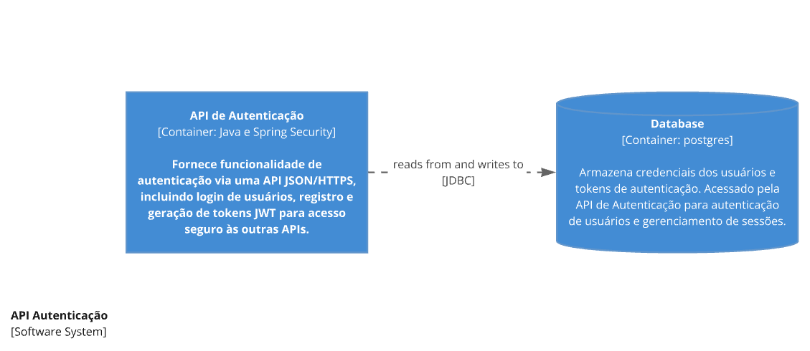

<h1 align="center">

 
  
  
  <a href="https://italokaique.theloopcode.com" target="_blank">
      <!-- sqlite, safari, google-chrome are other good icon options -->
  </a>

</h1>

### Informações da aplicação
1. API de usuarios para login, criação, atualização e deleção.
2. Versão v1.0.0
3. Criada com conhecimentos na materia "Tópicos Especiais em Ciência da Computação" na UTFPR

### Requisitos
1. Java ^17 em diante
2. Maven instalado

### Execução do projeto
1. Executar utilizando spring tools ou comandos CMD.

### Arquitetura
